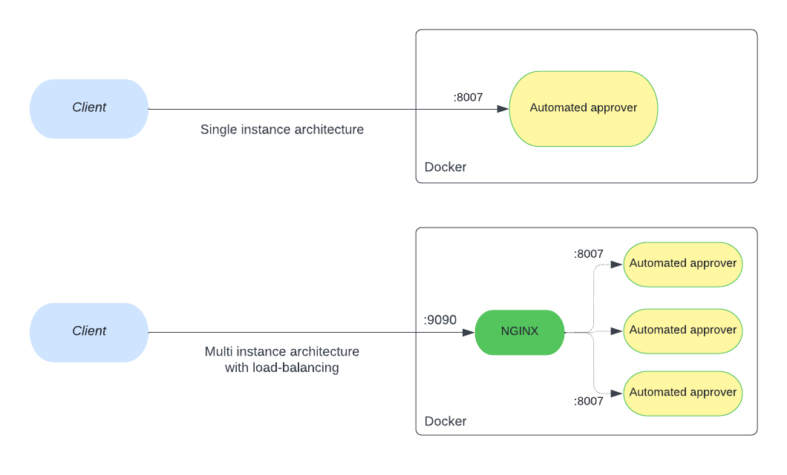

# Deployment Guide

## Overview

This document provides details on how to deploy the Signing Agent service.

## Supported platforms

Should work on UNIX systems. Windows is untested as a deployment environment, but there's nothing inherently non-portable, so it may well work.

## Building the binary and testing

The Signing Agent service is written in Go, using version go1.18+. It is a single executable. That executable binary can be built by running:

```bash
    go build
```

in the project root folder. This should be done on the same platform as the deployment platform, so that it uses the same CPU architecture.

This will create an executable called `taint` in the top level of the project.

For testing, just run the default Go testing suite:

```bash
    go test ./...
```

## Installation

If running as a Docker container, a host directory must be mounted as a virtual volume, in order to ensure data persistency between different container versions.

## Load balancing

**Note:** You should never run the service directly connected to the internet. All external requests to the API endpoints exposed by the Signing Agent should be done through a reverse proxy service (e.g., Nginx or HAProxy) and over TLS.

You should be able to run more than one container instance of the Signing Agent, and establish NGINX load balancer between available instances. A distributed mutex mechanism (based on Redis) is used to ensure synchronization between individual instances.



### Prerequisites

Docker installation, Docker compose and Golang environments must already be installed.

### Compile the project as docker image

First we need to enter the project directory:
```cd {project_dir}```

Second we need to build a Docker image, this can be done with:
```./build.sh docker```

All necessary files are located in: **{project_dir}/dockerfiles/load-balancing**

### Important variables

The `docker-compose.yml` presents:

- **deploy.replicas**: the number of instances we want to run
- **ports**: the port that accepts the requests

### Start the load balancer

Start the service using the command:

```docker-compose -f {project_dir}/dockerfiles/load-balancing/docker-compose.yml up aa nginx```

This prepares NGINX and automated-approver images.
NGINX uses the **nginx.conf** file to specify and rotate the requests between automated-approver running instances, where **worker_connections** represents the max concurrent connections the load balancer can handle.

### Stop the load balancer

Stop the service using the command:

```docker-compose -f {project_dir}/dockerfiles/load-balancing/docker-compose.yml down --remove-orphans```

Now you can start sending requests to `localhost:9090`.
You can change the *port* by editing **docker-compose.yml** and **nginx.conf**.


## Service configuration data

Please see the [YAML configuration template](configuration.md) documentation for a description of each configuration option available.

## Healthcheck endpoints

There are currently three healthcheck endpoints available.

### /healthcheck/version

The version healthcheck endpoint expects a `GET` request, and it responds with an HTTP 200 status code and a JSON payload containing the current build information:

```json
{
    "BuildVersion": "101c354",
    "BuildType": "dev",
    "BuildDate": "Fri Oct 7 12:53:12 UTC 2022"
}
```

### /healthcheck/config

The config healthcheck endpoint accepts a `GET` request, and it responds with an HTTP 200 status code and a JSON payload containing the current configuration file data:

```json
{
    "Base": {
        "QredoAPIDomain":"play-api.qredo.network",
        "QredoAPIBasePath":"/api/v1/p",
        "AutoApprove":false
        ...
    },
    "HTTP": {
        "Addr":"0.0.0.0:8007",
        "CORSAllowOrigins":["*"],
        ...
    },
    ...
}
```

### /healthcheck/status

The status healthcheck endpoint accepts a `GET` request, and it responds with an HTTP 200 status code and a JSON payload containing the status information for various services or external connections that are related to the Signing Agent service:

```json
{
    "WebSocket": {
        "ReadyState":"CLOSED",
        "RemoteFeedUrl": "wss://play-api.qredo.network/api/v1/p/coreclient/feed",
        "LocalFeedUrl":"ws://0.0.0.0:8007/api/v1/client/feed"
    }
}
```
