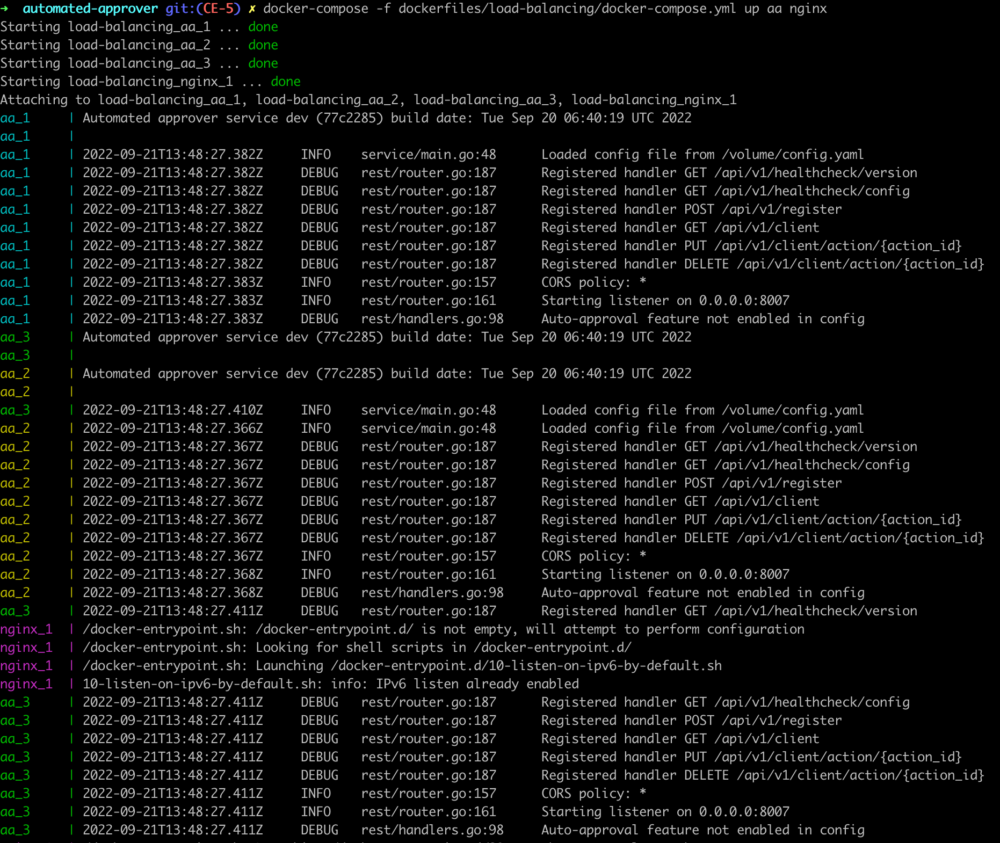

## Purpose
The purpose of the doc is to demonstrate how to run more than one container instance of the automated approver, and establish NGINX load balancer between available instances.
Distributed mutex mechanism (based on Redis) is used to ensure synchronization between individual instances.


## Prerequisites
Docker installation, Docker compose and Golang environments

## Compile the project as docker image

First we need to enter the project directory:
```cd {project_dir}```

Second we need to build a Docker image, this can be done with:
```./build.sh docker```

All necessary files are located in: **{project_dir}/dockerfiles/load-balancing**

## Important variables
The `docker-compose.yml` presents:

* **deploy.replicas**: the number of instances we want to run
* **ports**: the port that accepts the requests

## Start the load balancer
Start the service using the command:

```docker-compose -f {project_dir}/dockerfiles/load-balancing/docker-compose.yml up aa nginx```

This prepares NGINX and automated-approver images.
NGINX uses the **nginx.conf** file to specify and rotate the requests between automated-approver running instances, where **worker_connections** represents the max concurrent connections the load balancer can handle.

## Stop the load balancer
Stop the service using the command:

```docker-compose -f {project_dir}/dockerfiles/load-balancing/docker-compose.yml down --remove-orphans```

Now you can start sending requests to `localhost:9090`.
You can change the *port* by editing **docker-compose.yml** and **nginx.conf**.


