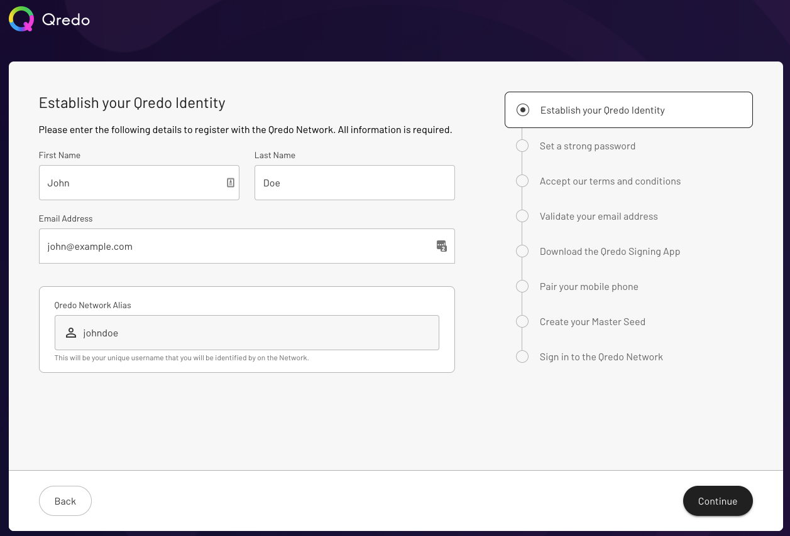
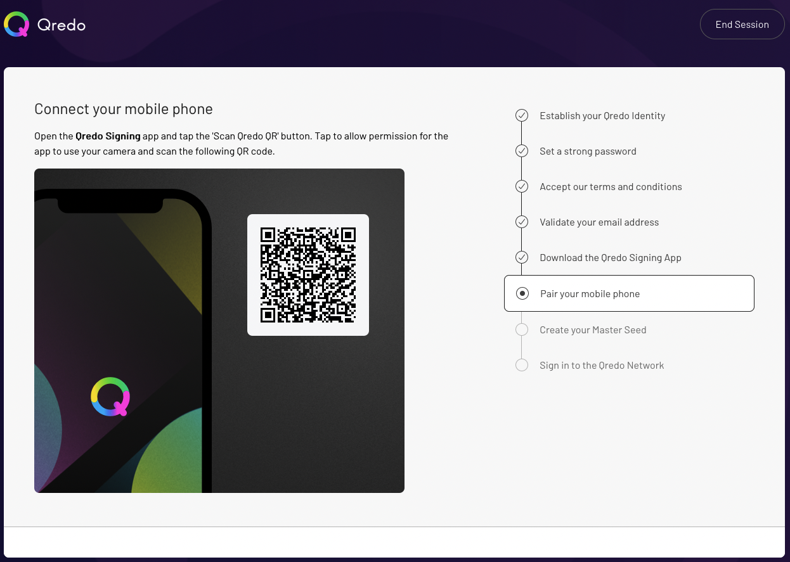
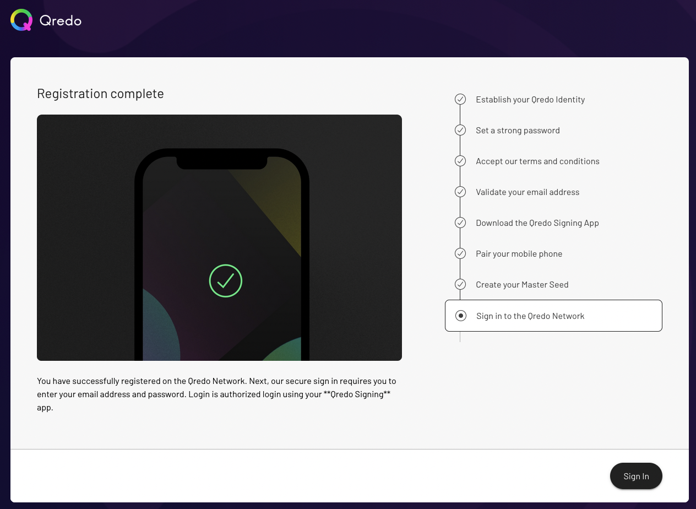
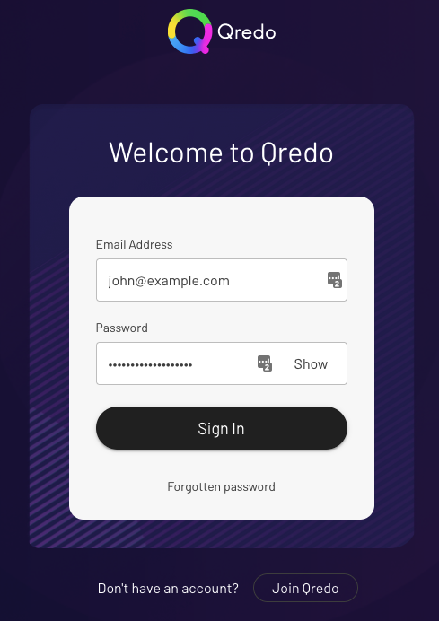
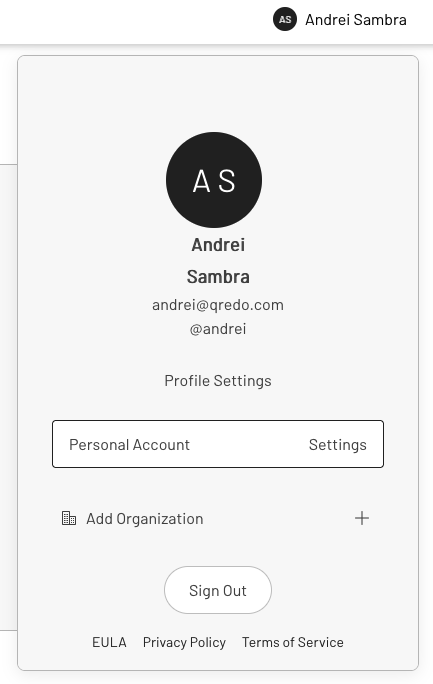
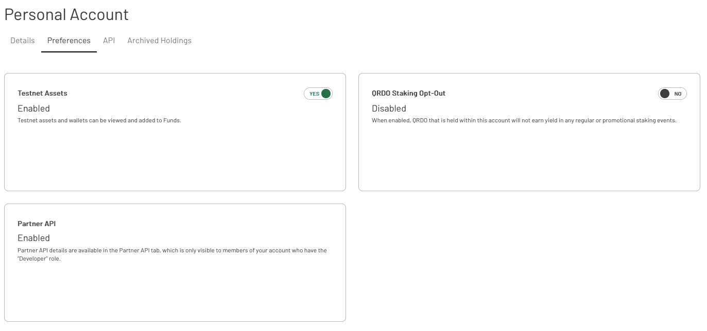
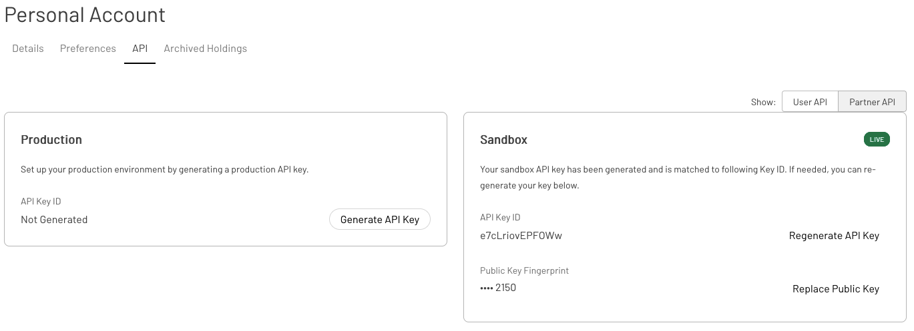
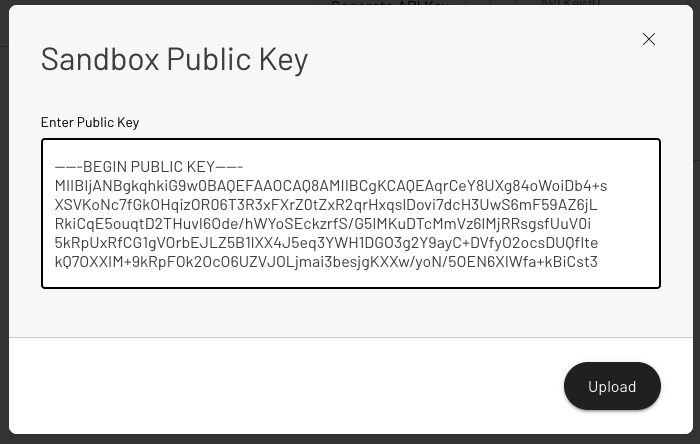
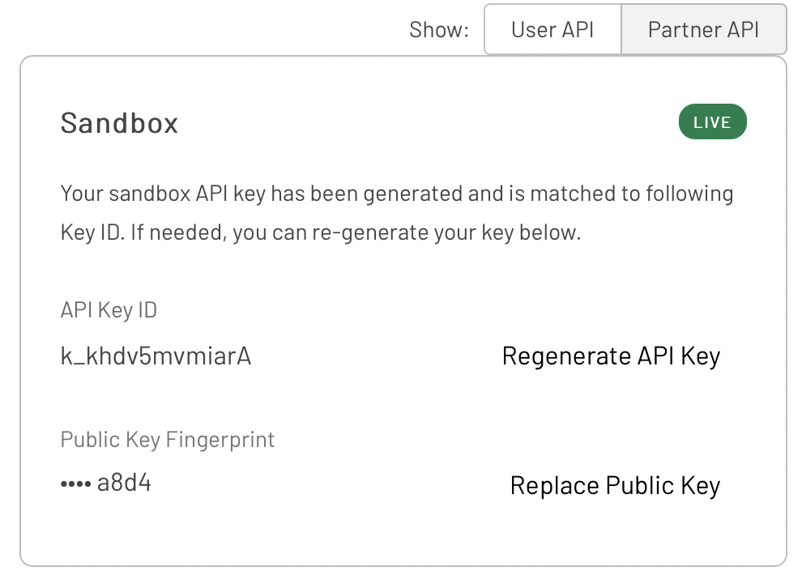

# Getting started - documentation for Partners

This guide provides all the steps necessary to integrate a 3rd party App (referred to as the **PartnerApp**) with the Signing Agent and our Partner API.

# Creating a Qredo account to obtain the API key

If you haven’t done so, please follow the following guide to first create an account on the Play environment, so you can test the Signing Agent in our sandbox environment before using it in production.

## Creating an account on the Play environment

The first step is to visit the Play environment app at [https://play.qredo.network/](https://play.qredo.network). This is a special-purpose sandbox environment that you can use for testing, without fear of breaking anything. Just click on the big “Join Qredo” button to get started.



Next, click Continue to go through the other steps until you reach “Pair your mobile phone”. From here on you must continue on the mobile application.





And that’s it. You can now sign into the Play environment and start using the Web app.

## Signing into the Play environment

Signing into your account is straightforward. Just type in the email address you registered with, as well as the password, and click on “Sign In”.



You will see a screen asking you to authenticate with your mobile app, and at the same time you should receive a notification on your phone to authenticate (make sure app notifications are turned on).


Follow the steps in the mobile app to approve the authentication request and you should be in.

## Obtaining the API key

- Before continuing with the guide, it is recommended you enable `Testnet Assets`. To do that, you need to first click your name on the right top corner and select “Personal Account” from the popup.



- Next, in the **Preferences** tab click on the toggle button to enable Testnet Assets (i.e., ETH-GOERLI and BTC-TESTNET).



- Finally, you have to generate API keys for the Partner API and the Signing Agent:
    - Select the **API** tab.
    - Click “Partner API” tab (top right) and generate keys for the sandbox environment (or regenerate them if needed). Make sure to copy it to the clipboard or a text file, to have it on hand later in the process.
    - On this page you will also have to upload the contents of the `public.pem` key file that you’ll generate in the next section. You can come back afterwards and upload it.



## Generate RSA keys for signing requests (Partner API)

The following example uses the terminal (CLI) for generating the RSA key pair but you can use any preferred tool to perform this task. The Qredo Partner API currently works with 2048 bit RSA keys.

1. Open a terminal and type the following commands:

2. Generate a 2048 bit RSA Key pair and store the private key in a file named private.pem using the CLI command:

`openssl genrsa -out private.pem 2048`

You should see the following message:

*Generating RSA private key, 2048 bit long modulus...*

3. Extract the public key from the key pair and store it in a file named `public.pem` using the command:

`openssl rsa -in private.pem -outform PEM -pubout -out public.pem`

When run you should see the following success message:

*writing RSA key*

4. Generate base64 representation of this `private.pem` key by running the following command in your terminal:

`base64 private.pem`

Finally, copy your base64-encoded token to the clipboard or a text file. You are going to use it as a part of the payload data on the registration endpoint when making the API call to the Signing Agent service.

## Upload Public Key

After having done the generation of the RSA keys in the steps below you have to upload your public key on the Qredo web interface.

Your `public.pem` should look like this:

```json
-----BEGIN PUBLIC KEY-----
MIIBIjANBgkqhkiG9w0BAQEFAAOCAQ8AMIIBCgKCAQEAqrCeY8UXg84oWoiDb4+s
XSVKoNc7fGkOHqizOR06T3R3xFXrZ0tZxR2qrHxqslDovi7dcH3UwS6mF59AZ6jL
RkiCqE5ouqtD2THuvI6Ode/hWYoSEckzrfS/G5IMKuDTcMmVz6lMjRRsgsfUuV0i
5kRpUxRfCG1gVOrbEJLZ5B1lXX4J5eq3YWH1DGO3g2Y9ayC+DVfyO2ocsDUQfIte
kQ7OXXIM+9kRpFOk2OcO6UZVJOLjmai3besjgKXXw/yoN/5OEN6XIWfa+kBiCst3
9dbslJKPNL8RdZIfM41wxrfajNqq+rvf9HhOVgQbPEc6qwjlkS6Dsd+TMWibujbq
YQIDAQAB
-----END PUBLIC KEY-----
```

Upload this to your corresponding environment in the modal after clicking on ‘Add Public Key’.



Once added, you will see the environment status turn to ‘Live’.



Now you are ready to send Partner API requests.

By this time, you should already have a Docker image for the Signing Agent. In order to be able to use it, you need to create a Docker volume (where config data lives) as well as a Docker container that uses the image.

# Deploying the Signing Agent

### Create a Docker volume for storing config data

You need to create a local folder to store the config data and also the agent database. When you run the Docker image, you must reference this local folder since it is shared between the local system and the Docker image. For this reason, we need to create the Docker volume first. If you are curious, you can go here to learn more about [Docker volumes](https://docs.docker.com/storage/volumes/).

At this stage, we will create a local folder and name it `volume`.

In the terminal, run this command to create the folder in your home dir:

`mkdir /home/user/volume`

Next, you can create the Docker volume (please use full path):

`docker volume create --name volume_folder --opt type=none --opt device=/home/user/volume --opt o=bind`

### Run the Signing Agent image

**Important!** before running the docker image, please make sure to copy the `config.yaml` (YAML configuration) file provided with the image to your local `volume`.

1. Import the Docker image you obtained from Qredo:

`docker load < /path/to/docker/image.tar`

2. Run the Docker image in the terminal, using the command:

`docker run -p 8007:8007 -v volume_folder:/volume signing-agent:dev`

You can now continue with testing of the Docker image.

### Configuration

Please make sure to copy the `config.yaml` (YAML configuration) file provided with the image to the `volume` directory.

Please see [the configuration documentation](https://www.notion.so/Configuration-file-documentation-b191dd91186e4ec69b92d05ab3d22ff6) for a `config.yaml` example and a description of each configuration option available.

# Registering the Signing Agent Service

When everything is set up properly (Qredo account creation is complete, and the public key has been locally generated and uploaded through the Web interface), we can start using the Signing Agent service. For the following examples, we assume the Signing Agent service is running at `https://agent.example.org/`.

The PartnerApp triggers the registration process by providing an agent name to the Signing Agent service. You will also need to provide the `API key` and the `Base64PrivateKey` you generated above.

Make sure to remember the `agentID` value, since you will need it afterwards.

```bash
**Request**:

curl -X 'POST' \
  'https://agent.example.org/api/v1/register' \
  -H 'Content-Type: application/json' \
  -d '{
				"name": "Test Agent",
				"apikey": "Partner APIKey from the webpage",
				"base64privatekey": "token from the clipboard"
}'

**Response**:

{
	"agentID":"CBApocs97bS7SgE21Ht5xRHFWRbcrH9AMZHgsoUd2gpp",
	"feedURL":"ws://localhost:8007/api/v1/client/CBAp...2gpp/feed"
}
```

Once the Signing Agent registration process is complete, we can now proceed to creating a company through the Partner API, effectively enabling us to then have a fund and wallets.

# Using the Partner API

The Partner API will be used to set up and manage all the funds and wallets, as well as to create transactions. The official documentation page for the Partner API can be found at [https://developers.qredo.com/partner-api/getting-started/](https://developers.qredo.com/partner-api/getting-started/).

We also offer a Swagger page to help you understand how our API endpoints work — [https://play-swagger.qredo.network/#/](https://play-swagger.qredo.network/#/).

**NOTE:** All requests to the Partner API must be signed. Please refer to this documentation page for signing API calls — [https://developers.qredo.com/partner-api/getting-started/sign-api-calls/](https://developers.qredo.com/partner-api/getting-started/sign-api-calls/). The following examples contain made up values for signatures and API keys. Please do not attempt to copy/paste them as they will not work.

## Create a company

To create a company, we need to call the PartnerAPI and to provide some details for the company. Please make sure to store the `company_id` you receive in the response, since you will need it later. More details in the [official documentation for the PartnerAPI](https://developers.qredo.com/partner-api/quickstart/01-create-company/) and in the Partner-API-Sign tool that can be found on github [partner-api-sign](https://github.com/qredo/partner-api-sign).

```bash
**Request:**

curl -X 'POST' \
  'https://play-api.qredo.network/api/v1/p/company' \
  -H 'accept: application/json' \
  -H 'x-timestamp: 1668069089' \
  -H 'x-sign: r76j7xH....QpUxEw' \
  -H 'X-API-KEY: eyJrZXl...6dHJ1ZX0' \
  -H 'Content-Type: application/json' \
  -d '{
  "name": "TestCompany",
  "city": "Paris",
  "country": "FR",
  "domain": "company.com",
  "ref": "a-b-c-d-e"
}'

Response:

{
	"company_id":"2Bfg0fYqMhaSQ1ZvowpH02mDEaH",
	"ref":"a-b-c-d-e"
}
```

## Add the Signing Agent as a Trusted Party

Using the `company_id` from the previous step (replace the red text in the example URL), we can now add the ID of the Signing Agent as a trusted party for the newly created company. Just use the agent ID in the `address` attribute of the payload.

This is important, because otherwise there is no way to programatically add the Agent to the Fund and Wallet policies. **Only trusted parties can be added to security policies.** More details for this request can be found in the [official documentation for the PartnerAPI](https://developers.qredo.com/partner-api/core-client/set-up-core-client/#2-enlist-the-core-client-as-a-trusted-party).

```bash
**Request:**

curl -X 'POST' \
  'https://play-api.qredo.network/api/v1/p/company/{company_id}/trustedparty' \
  -H 'accept: application/json' \
  -H 'x-timestamp: 1668069089' \
  -H 'x-sign: r76j7xH....QpUxEw' \
  -H 'X-API-KEY: eyJrZXl...6dHJ1ZX0' \
  -H 'Content-Type: application/json' \
  -d '{"address":"CBApocs97bS7SgE21Ht5xRHFWRbcrH9AMZHgsoUd2gpp"}'

**Response:**

{"code":200,"msg":"OK"}
```

## Create a fund with a wallet and corresponding policies

Here we are explicitly creating a new fund, while at the same time defining the **withdraw** and **transaction** policies for it. We are also creating a new *ETH-GOERLI* wallet with its own withdraw and transaction policies. The Play environment also supports *BTC-TESTNET*. The only member we are now adding to all the policies is the Signing Agent (using the `agentID` we received during the registration step). Please make sure to store the `fund_id` you receive in the response, since you will need it later. More details for this particular request can be found in the [official documentation for the PartnerAPI](https://developers.qredo.com/partner-api/quickstart/03-create-fund/).

```bash
**Request:**

curl -X 'POST' \
  'https://play-api.qredo.network/api/v1/p/company/{company_id}/fund' \
  -H 'accept: application/json' \
  -H 'x-timestamp: 1668069089' \
  -H 'x-sign: r76j7xH....QpUxEw' \
  -H 'X-API-KEY: eyJrZXl...6dHJ1ZX0' \
  -H 'Content-Type: application/json' \
  -d '{
  "name": "Test Fund",
  "description": "Test Fund with agent policy",
  "custodygroup_withdraw": {
    "threshold": 1,
    "members": [
      "...replace with id from the register result..."
    ]
  },
  "custodygroup_tx": {
    "threshold": 1,
    "members": [
      "...replace with id from the register result..."
    ]
  },
  "wallets": [
    {
      "name": "New wallet with custom custody group",
      "asset": "ETH-GOERLI",
      "custodygroup_withdraw": {
        "threshold": 1,
        "members": [
          "...replace with id from the register result..."
        ]
      },
      "custodygroup_tx": {
        "threshold": 1,
        "members": [
          "...replace with id from the register result..."
        ]
      }
    }
  ]
}'

**Response**:

{
	"fund_id":"2BfgvL0K8wlDYAZ3GYHsfrVvSFq",
	"custodygroup_withdraw":"2BfgvM8r63hEAeSQlwZdjgGsuOj",
	"custodygroup_tx":"2BfgvKMhdq6Z0dgNDmwq8wTIORg"
}
```

## Discover wallet address and deposit testnet assets to the wallet

Since we have created a fund with an ETH-GOERLI asset type (Goerli testnet), we can now try to deposit some test ETH. To do that, first we need to find out the ETH address to which we need to send the assets. We’ll ask for the list of fund assets with their deposit addresses and current balances. Each fund contains one or more deposit addresses for the different types of assets. As you can see below, for this request we have supplied the `company_id` and `fund_id` we previously obtained in the API URL.

```bash
**Request**:

curl -X 'GET' \
  'https://play-api.qredo.network/api/v1/p/company/{company_id}/fund/{fund_id}/deposit' \
  -H 'accept: application/json' \
  -H 'x-timestamp: 1668069089' \
  -H 'x-sign: r76j7xH....QpUxEw' \
  -H 'X-API-KEY: eyJrZXl...6dHJ1ZX0'

**Response**:

{
  "total_count": 1,
  "list": [
    {
      "asset": "ETH-GOERLI",
      "address": "0x9B2154307C4987B9e67389cea8795E921b71e117",
      "balance": 0
    }
  ]
}
```

You can now send Goerli ETH from any account to the above address — i.e. `0x9B2154307C4987B9e67389cea8795E921b71e117`. Performing the same request at a later point in time will show a change in the balance value.

## Whitelist addresses for withdrawals (L1)

Before we can withdraw assets on L1, we need to whitelist the external wallet address. More details for this request can be found in the [official documentation for the PartnerAPI](https://developers.qredo.com/partner-api/quickstart/06-perform-withdrawal/#1-whitelist-a-withdrawal-address).

```bash
**Request:**

curl -X 'POST' \
  'https://play-api.qredo.network/api/v1/p/company/{company_id}/fund/{fund_id}/whitelist' \
  -H 'x-timestamp: 1668069089' \
  -H 'x-sign: r76j7xH....QpUxEw' \
  -H 'X-API-KEY: eyJrZXl...6dHJ1ZX0' \
  -H 'Content-Type: application/json' \
  -d '{
  "name": "Metamask",
  "asset": "ETH-GOERLI",
  "address": "0x5F1F7bD49690c...9Be67ED6A2b6F76c86127"
}'

**Response:**

{"code":200,"msg":"OK"}
```

## Discover wallet id from the created fund

Before we can initiate a transfer or withdrawal we need to find the wallet id, which can be retrieved from the fund details from the partner api:


```bash
**Request:**

curl -X 'GET' \
  'https://play-api.qredo.network/api/v1/p/company/{company_id}/fund/{fund_id}' \
  -H 'x-timestamp: 1668069089' \
  -H 'x-sign: r76j7xH....QpUxEw' \
  -H 'X-API-KEY: eyJrZXl...6dHJ1ZX0'

**Response:**
...
    "assets": ["ETH-GOERLI"],
    "wallets": [{
        "wallet_id": "DgAjqzoRg9yuTbZ4SVpeWJoZE9stNEpo7THu5YMq57KX",
...
```

## L1 transaction (withdraw) to external wallet

Here we are requesting a withdrawal of 1000 gwei to an external wallet that we have previously whitelisted. We are providing the `company_id` as well as the `wallet_id` from which we are making the withdrawal. More details for this request can be found in the [official documentation for the PartnerAPI](https://developers.qredo.com/partner-api/quickstart/06-perform-withdrawal/#2-submit-withdrawal-request).

```bash
**Request:**

curl -X 'POST' \
  'https://play-api.qredo.network/api/v1/p/company/{company_id}/withdraw' \
  -H 'accept: application/json' \
  -H 'x-timestamp: 1668069089' \
  -H 'x-sign: r76j7xH....QpUxEw' \
  -H 'X-API-KEY: eyJrZXl...6dHJ1ZX0' \
  -H 'Content-Type: application/json' \
  -d '{
  "wallet_id": "DgAjqzoRg9yuTbZ4SVpeWJoZE9stNEpo7THu5YMq57KX",
  "address": "0x5F1F7bD49690c...9Be67ED6A2b6F76c86127",
  "expires": 1657389752,
  "benefit_of": "John Smith",
  "account_no": "123-XX",
  "reference": "CX15R99XX",
  "partner_txID": "",
  "send": {
    "symbol": "ETH-GOERLI",
    "amount": 1000
  }
}'

**Response**:

{
	"tx_id":"2BfisRs6MiHMbowbmpFdSW8uqVg",
	"status":"new"
}
```

## L2 transaction (transfer) via Signing Agent Service

The L2 transaction (or transfer) is very similar to the withdrawal operation, except that it will incur no fees. The only difference is that a transfer uses `wallet_id` instead of `address` for the counterparty — e.g. `8uefDb78XGtsbzf1SAZWnxGnSbVHwZdndCvZvGtRjTXF`. More details for this request can be found in the [official documentation for the PartnerAPI](https://developers.qredo.com/partner-api/quickstart/05-perform-transfer/).

```bash
**Request:**

curl -X 'POST' \
  'https://play-api.qredo.network/api/v1/p/company/{company_id}/transfer' \
  -H 'accept: application/json' \
  -H 'x-timestamp: 1668069089' \
  -H 'x-sign: r76j7xH....QpUxEw' \
  -H 'X-API-KEY: eyJrZXl...6dHJ1ZX0' \
  -H 'Content-Type: application/json' \
  -d '{
  "wallet_id": "DgAjqzoRg9yuTbZ4SVpeWJoZE9stNEpo7THu5YMq57KX",
  "counterparty_wallet_address": "8uefDb78XGtsbzf1SAZWnxGnSbVHwZdndCvZvGtRjTXF",
  "expires": 1657389752,
  "benefit_of": "John Smith",
  "account_no": "123-XXX",
  "reference": "ABC123",
  "partner_txID": "some-partner-txxID",
  "send": {
    "symbol": "ETH-GOERLI",
    "amount": 50000
  }
}'

**Response:**

{
	"tx_id":"2BfnVsCH9khcTCDX27W8fdbMeXV",
	"status":"new"
}
```